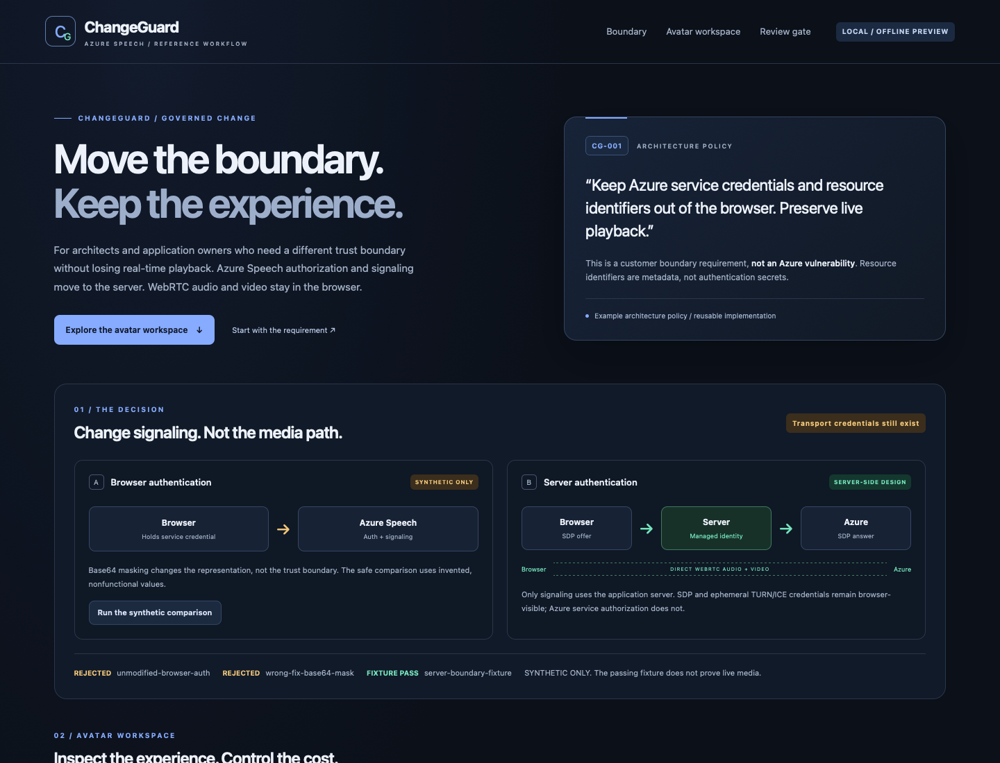
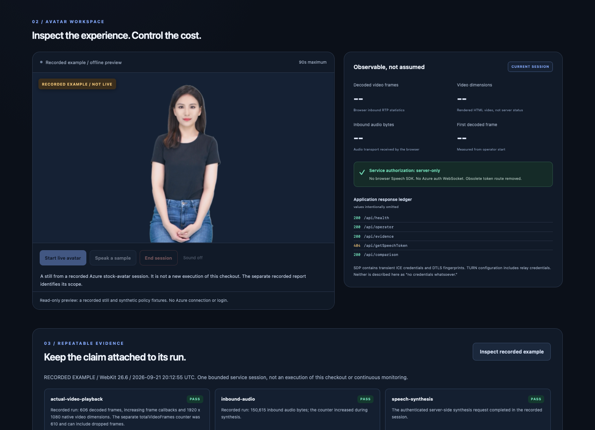
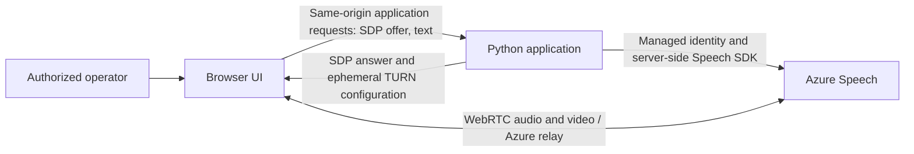

# ChangeGuard

ChangeGuard is a reference application and workflow for moving **Azure Speech service authorization and WebRTC signaling to the server** while keeping real-time avatar media in the browser.

It is for architects and application owners who need to enforce an application-specific trust boundary without replacing the playback experience. The repository includes a working Python/JavaScript application, a credential-free offline preview, lifecycle regression tests, optional Azure infrastructure, and portable review prompts.

**This is an architectural policy, not a claim of an Azure vulnerability.** Resource identifiers are metadata, not authentication secrets. An authorized operator still receives the SDP and short-lived TURN/ICE credentials required for WebRTC transport. Encoding a service token with base64 changes its representation, not who can use it.



*Actual offline UI: the invented baseline and encoded-token workaround are rejected by the same policy check.*



*Actual offline workspace with a recorded Azure stock-avatar still, not a new live session. Current-session counters remain unset; recorded measurements are labeled separately.*

## What you can inspect

- Compare an invented browser-authentication baseline, an equally invalid base64 workaround, and the server boundary using the same policy checks.
- Follow operator authorization, server-side Speech SDK negotiation, and direct browser-to-Azure media without a browser Speech SDK or token-issuing endpoint.
- Exercise bounded ownership and cleanup: one concurrent session, a maximum 90-second server deadline, persistent start limits, and retryable closure.
- Separate current-session measurements from a clearly labeled [recorded example](docs/recorded-example.md). A still image or HTTP 200 is not evidence of current playback.
- Reuse the [requirement and role prompts](workflow/agent-prompts.md) with GitHub Copilot App or another development workflow. Automation prepares evidence; human review remains a separate decision.

## Quick start: offline preview

Use **Python 3.12**. No Azure account, cloud login, operator token, secret store, or Node.js installation is needed for the preview. Package installation needs network access; the running preview uses local application assets and never starts an Azure session.

```bash
git clone https://github.com/jrubiosainz/changeguard.git
cd changeguard
python3.12 -m venv .venv
source .venv/bin/activate
python -m pip install --require-hashes -r requirements.txt
python scripts/run_local.py
```

On Windows, use PowerShell for the environment setup, then the same `python` commands:

```powershell
py -3.12 -m venv .venv
.\.venv\Scripts\Activate.ps1
python -m pip install --require-hashes -r requirements.txt
python scripts/run_local.py
```

Open **http://127.0.0.1:8033**. Run the synthetic comparison, inspect the recorded example, and read the request ledger. Live controls are disabled and there is no login step. The launcher always selects loopback-only offline mode, even when the shell contains live configuration. Use `--port 8047` if the default port is occupied; stop with Ctrl+C.

If PowerShell activation is restricted, invoke `.\.venv\Scripts\python.exe` instead of `python`; activation is optional. The launcher also works from another working directory when called by its absolute path. [`.env.example`](.env.example) documents settings but is **not automatically loaded**.

## Architecture



Only authorization and signaling traverse the application server. Audio and video are not proxied through Python. The browser boundary guard inspects application responses for service-authorization material and configured resource identifiers; it is a bounded policy check, not a general security certification.

See [architecture and API boundaries](docs/architecture.md) for the request flow, error handling, source identity, and deployment constraints.

## Optional authenticated Azure setup

The default preview cannot spend on Azure. Live mode requires an explicitly configured HTTPS origin, independent application operator and signing secrets, a Speech resource with a custom subdomain, and server-side Azure identity. The [Azure setup guide](docs/azure-setup.md) explains environment variables, the optional [Bicep template](infra/main.bicep), scoped identity permissions, and cost-confirming commands.

The template uses a dedicated resource group such as `rg-changeguard`, one Linux App Service B1 instance, and Speech S0 with local/key authentication disabled. Deployment and live evaluation are separate opt-in operations. Neither is part of quick start or CI.

## Tests and inspection

Python tests include a **Node.js 20+** lifecycle harness; Node is needed for development checks, not for running the application.

```bash
python -m pip install -r requirements-dev.txt
python -m pytest
python -m ruff check .
node --test tests/ui_lifecycle.cjs
python scripts/policy_gate.py --candidate server
```

The negative controls should exit with status **1**, not succeed:

```bash
python scripts/policy_gate.py --candidate baseline
python scripts/policy_gate.py --candidate wrong-fix
```

For an optional real-browser check of the offline UI:

```bash
python -m playwright install webkit
python scripts/verify_ui.py
```

These commands do not start Azure media. Generated reports, screenshots, budgets, and deployment receipts stay under ignored `.runtime/`. Current tests run against the current source; the separate recorded service example does not assert that a fresh checkout has passed a live test.

## Safe operation and limits

Live sessions require an application operator token exchanged for a 30-minute HttpOnly, SameSite=Strict cookie. Same-origin request checks apply to state-changing endpoints. The server allows one session, at most eight starts per rolling hour, at least 60 seconds between starts, and at most three speech requests of 280 characters per session. A failed close keeps the slot reserved rather than permitting a second session.

The single-process session manager is **not a horizontally scalable production design**, and the operator token is not enterprise SSO. App Service B1 has standing charges and does not scale to zero; application limits are not an Azure spending cap. A browser/network failure is reported explicitly, with no automatic billable start retry. Review [operations, costs, and data handling](docs/operations.md) before any live use.

## Repository map

| Path | Purpose |
| --- | --- |
| `app.py`, `changeguard/` | Flask entry point, authorization, provider, policy, and lifecycle |
| `static/`, `templates/` | Browser application and labeled read-only example |
| `tests/` | Offline Python and actual JavaScript regression tests |
| `scripts/` | Local launcher, policy checks, optional deployment and evaluation |
| `infra/` | Optional resource-scoped Azure Bicep |
| `workflow/` | Requirement, architecture proposal, and reusable operator prompts |
| `docs/` | Architecture, setup, operation, and measurement interpretation |

The Speech SDK signaling pattern is influenced by the Microsoft sample; see [third-party notices](THIRD_PARTY_NOTICES.md). Those notices preserve applicable sample permissions and do not declare a license for the entire repository.
